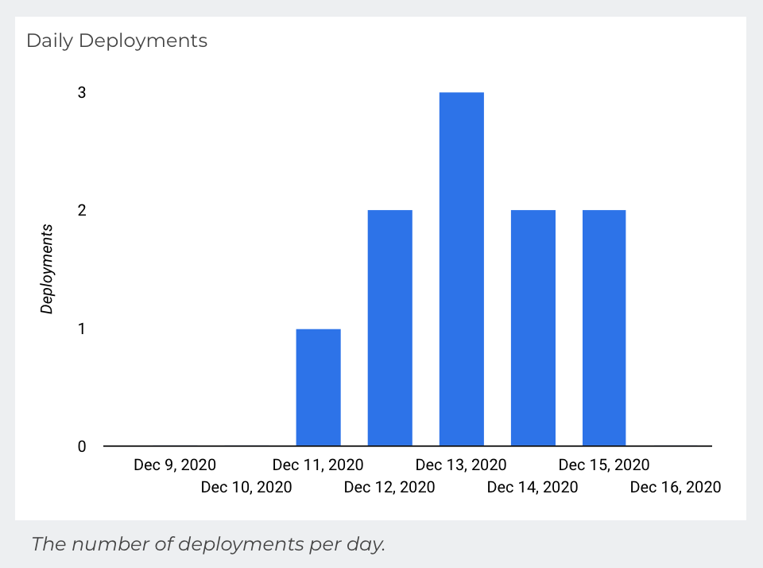
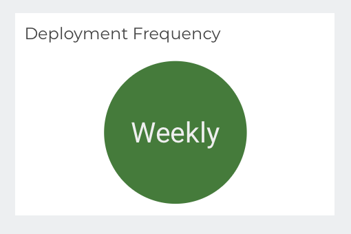

# Four Key Metrics Calculations

For each of the metrics, the dashboard shows a running daily calculation, as well as a 90 day bucketed view.  The 90 day buckets are categorized per the [2019 State of DevOps Report](https://www.devops-research.com/research.html#reports). 

**Deployment Frequency**

*   How frequently organization successfully releases to production. 

** Daily Deployment Volumes **


This is the simplest of the charts to create. 

``` sql
SELECT
TIMESTAMP_TRUNC(time_created, DAY) AS day,
COUNT(distinct deploy_id) AS deployments
FROM
four_keys.deployments
GROUP BY day;
```

This script is very straight forward.  We simply want the daily volume of distinct deployments.

***   Calculating the bucket 

Here we see more complexity.  The first thing to consider is that to calculate frequency, we need rows for the days with no deployments. To achieve this, we unpack a date array to join against our table, which will create Null values for days without deployments.

```sql
WITH last_three_months AS
(SELECT
TIMESTAMP(day) AS day
FROM
UNNEST(
GENERATE_DATE_ARRAY(
    DATE_SUB(CURRENT_DATE(), INTERVAL 3 MONTH), CURRENT_DATE(),
    INTERVAL 1 DAY)) AS day
# FROM the start of the data
WHERE day > (SELECT date(min(time_created)) FROM four_keys.events_raw)
)

SELECT
last_three_months.day,
deploy_id
FROM last_three_months
LEFT JOIN(
  SELECT
  TIMESTAMP_TRUNC(time_created, DAY) AS day,
  deploy_id
  FROM four_keys.deployments) deployments ON deployments.day = last_three_months.day;
```

Now we have a full picture of the last three months, and will use this to calculate the frequency.  To do this we have to decide what each bucket means.  

- Daily: Over the last three months, the median number of days per week with deployments is equal to or greater than three.  Ie, most working days have deployments.
- Weekly: Over the last three months, the median number of days per week with deployments is at least 1.  Ie, most weeks have at least one deployment.
- Monthly:  Over the last three months, the median number of deployments per month is at least 1.  Ie, most months have at least one deployment.
- Yearly: Any frequency slower than Monthly.  This is the else statement and will default to Yearly if the above conditions are not met. 

```sql
WITH last_three_months AS
(SELECT
TIMESTAMP(day) AS day
FROM
UNNEST(
GENERATE_DATE_ARRAY(
    DATE_SUB(CURRENT_DATE(), INTERVAL 3 MONTH), CURRENT_DATE(),
    INTERVAL 1 DAY)) AS day
# FROM the start of the data
WHERE day > (SELECT date(min(time_created)) FROM four_keys.events_raw)
)

SELECT
CASE WHEN daily THEN "Daily" 
     WHEN weekly THEN "Weekly" 
      # If at least one per month, then Monthly
     WHEN PERCENTILE_CONT(monthly_deploys, 0.5) OVER () >= 1 THEN  "Monthly" 
     ELSE "Yearly"
     END as deployment_frequency
FROM (
  SELECT
  # If the median number of days per week is more than 3, then Daily
  PERCENTILE_CONT(days_deployed, 0.5) OVER() >= 3 AS daily,
  # If most weeks have a deployment, then Weekly
  PERCENTILE_CONT(week_deployed, 0.5) OVER() >= 1 AS weekly,

  # Count the number of deployments per month.  
  # Cannot mix aggregate and analytic functions, so calculate the median in the outer select statement
  SUM(week_deployed) OVER(partition by TIMESTAMP_TRUNC(week, MONTH)) monthly_deploys
  FROM(
      SELECT
      TIMESTAMP_TRUNC(last_three_months.day, WEEK) as week,
      MAX(if(deployments.day is not null, 1, 0)) as week_deployed,
      COUNT(distinct deployments.day) as days_deployed
      FROM last_three_months
      LEFT JOIN(
        SELECT
        TIMESTAMP_TRUNC(time_created, DAY) AS day,
        deploy_id
        FROM four_keys.deployments) deployments ON deployments.day = last_three_months.day
      GROUP BY week)
 )
LIMIT 1;
```

**Lead Time for Changes**

*   The median amount of time for a commit to be deployed into production.

**Time to Restore Services**

*   For a failure, the median amount of time between the deployment which caused the failure and the restoration.  The restoration is measured by closing an associated bug / incident report. 

**Change Failure Rate**

*   The number of failures per the number of deployments. For example, if there are four deployments in a day and one causes a failure, that is a 25% change failure rate.


